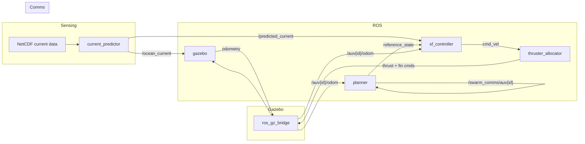

# A pysical simulator for ECA A9 

Multi-agent formation control simulation for ECA A9 AUVs in Gazebo Harmonic, integrating a consensus-based formation planner, sliding-mode tracking controller, and data-driven ocean current prediction.

## Quick Start

```bash
# Build
cd ~/your_ws
colcon build --packages-select auv_leaders_planner tracking_control model
source install/setup.bash

# Launch (3 AUVs, Gazebo + RViz)
ros2 launch auv_leaders_planner leaders_planner.launch.py gui:=true rviz:=true
```

## Dependencies

- **ROS 2 Jazzy** + Gazebo Harmonic (`ros_gz_sim`)
- **[Project DAVE](https://github.com/Field-Robotics-Lab/dave)** — underwater hydrodynamics, buoyancy, and thruster plugins (`gz-sim-hydrodynamics-system`, `gz-sim-buoyancy-system`, etc.)
- **Python packages**: `torch`, `netCDF4`, `scikit-learn`, `numpy` (current predictor)

> The launch file expects DAVE installed at `/home/lu/dave_ws/install`. Set `dave_prefix` in `leaders_planner.launch.py` to your path, or export `DAVE_WS_PATH`.

## Packages

| Package | Description |
|---------|-------------|
| `auv_leaders_planner` | Formation planner, current predictor node, NetCDF ocean-current playback |
| `tracking_control` | SF local tracking controller, thruster-to-actuator allocator |
| `model` | ECA A9 URDF/Xacro model with Gazebo plugins, simulation world, mesh assets, optional sensor macros |

## Architecture



## Key Parameters

| Parameter | Value | Note |
|-----------|-------|------|
| AUV mass (URDF) | 100.8 kg | Collision geometry ≈ cylinder 2.35m × ⌀0.23m |
| AUV mass (controller) | 100.0 kg | Tuned vehicle-model parameter |
| Displacement volume | 0.098 m³ | ~98.5 L, near-neutral buoyancy |
| COB—COM distance (BG) | 0.08 m | COB at +0.06m, COM at −0.02m in body frame |
| Surge linear damping | −8.0 N/(m/s) | |
| Pitch damping | −20.0 N·m/(rad/s) | |
| Yaw damping | −32.0 N·m/(rad/s) | |

## Model Sources

- **ECA A9 URDF & mesh** — adapted from the [UUV Simulator](https://github.com/uuvsimulator/uuv_simulator) ECA A9 description
- **Hydrodynamics, buoyancy, thruster, and sensor plugins** — from [Project DAVE](https://github.com/Field-Robotics-Lab/dave)
- **Ocean current data** — NetCDF fields from operational ocean model outputs
